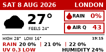
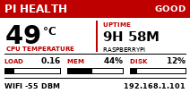

# Inky Dashboard

A compact, internet-connected desk dashboard for the original 212×104
[Pimoroni Inky pHAT](https://shop.pimoroni.com/products/inky-phat), connected to
a [Raspberry Pi Zero W](https://www.raspberrypi.com/products/raspberry-pi-zero-w/).
It rotates among weather, market, artwork, Raspberry Pi health and internet
speed widgets every three minutes.

## Available widgets

| ID | Widget | What it shows |
| --- | --- | --- |
| `weather` | London weather | Date, location, weather icon, temperature, feels-like temperature, rain probability, European AQI, daily high/low, three-hour rain outlook, UV index and humidity. |
| `bitcoin` | BTC/USD market | Current price, 24-hour direction and percentage change. A falling price is red; a flat or rising price is black because this panel cannot display green. |
| `emblem` | Lion and Sun | The supplied vector artwork, scaled proportionally, thresholded for crisp e-ink edges and centred in red. |
| `health` | Pi health | CPU temperature, uptime, one-minute load, memory and storage use, Wi-Fi signal, IP address and an at-a-glance health status. |
| `speedtest` | Internet speed | Internet provider, cached Pi Wi-Fi download and upload speeds, ping and the time of the latest Ookla Speedtest. |

## Widget previews

| London weather | BTC/USD market |
| :---: | :---: |
|  |  |
| Lion and Sun | Pi health |
|  |  |
| Internet speed | |
|  | |

The ordered list in [`config/widgets.json`](config/widgets.json) controls which
enabled widget appears next. State survives restarts, failed widgets are retried
and a lock prevents overlapping e-ink updates. The text-based widgets use DejaVu
Sans for clean rendering on the panel's limited colour palette.

## Hardware and software

- [Raspberry Pi Zero W](https://www.raspberrypi.com/products/raspberry-pi-zero-w/),
  or another network-connected Raspberry Pi with a fitted 40-pin GPIO header
- Original [Pimoroni Inky pHAT](https://shop.pimoroni.com/products/inky-phat),
  212×104 red/black/white model
- MicroSD card with [Raspberry Pi OS](https://www.raspberrypi.com/software/)
- Suitable micro-USB power supply
- Python 3.9 or newer
- DejaVu Sans fonts (`fonts-dejavu-core` on Raspberry Pi OS)
- Pillow and Pimoroni's `inky` Python package
- Ookla Speedtest CLI (required only by the `speedtest` widget)

> [!IMPORTANT]
> Pimoroni's current retail Inky pHAT is a newer 250×122 four-colour model. This
> repository is calibrated for the original 212×104 red/black/white revision;
> the current model is not yet a tested drop-in replacement and would need
> display-driver and layout adaptations.

Pimoroni recommends installing its library from the official `inky` repository,
which also configures the required SPI interface:

```bash
git clone https://github.com/pimoroni/inky
cd inky
./install.sh
```

## Install on the Pi

Clone this repository, then run the installer with the Python interpreter that
contains the Inky library:

```bash
git clone https://github.com/mahdi/phat.git ~/inky-dashboard
cd ~/inky-dashboard
INKY_PYTHON=~/.virtualenvs/pimoroni/bin/python ./scripts/install.sh
```

The installer renders the service template for the current checkout and user,
disables the obsolete weather-only timer if present, and enables
`inky-rotation.timer`.

The internet-speed widget uses the official
[Ookla Speedtest CLI](https://www.speedtest.net/apps/cli). Follow Ookla's
installation instructions for your Raspberry Pi OS version, then run
`speedtest` once interactively to review and accept its EULA, terms and privacy
policy. Results are cached for 60 minutes by default, so normal three-minute
widget rotation does not launch a bandwidth test every time. Set
`INKY_SPEEDTEST_CACHE_MINUTES` in the service environment to change that period.
The result measures connectivity from the Pi itself, so it is limited by the
Pi's network hardware rather than representing the maximum speed of the
broadband plan. In particular, the original Pi Zero W has single-band 2.4 GHz
Wi-Fi and cannot saturate a modern fibre connection.

Useful checks:

```bash
systemctl list-timers inky-rotation.timer
journalctl -u inky-rotation.service -n 30 --no-pager
```

## Preview without updating the display

Run any widget with `--preview`:

```bash
PYTHONPATH=src python3 -m inky_dashboard.widgets.weather --preview weather-preview.png
PYTHONPATH=src python3 -m inky_dashboard.widgets.bitcoin --preview bitcoin-preview.png
PYTHONPATH=src python3 -m inky_dashboard.widgets.emblem --preview emblem-preview.png
PYTHONPATH=src python3 -m inky_dashboard.widgets.health --preview health-preview.png
PYTHONPATH=src python3 -m inky_dashboard.widgets.speedtest --preview speedtest-preview.png --demo
```

## Add another widget

Add one object to [`config/widgets.json`](config/widgets.json). Commands are
argument arrays rather than shell strings. `{python}` expands to the active
Python interpreter and `{project_root}` expands to the repository path.

```json
{
  "id": "example",
  "name": "Example widget",
  "enabled": true,
  "working_directory": "{project_root}",
  "command": ["{python}", "-m", "inky_dashboard.widgets.example"]
}
```

The controller automatically includes enabled entries in their listed order;
no scheduler changes are needed. Set `enabled` to `false` to retain a widget
without showing it.

## Data sources

- Weather, rain and humidity: [Open-Meteo Weather API](https://open-meteo.com/en/docs)
- AQI and UV: [Open-Meteo Air Quality API](https://open-meteo.com/en/docs/air-quality-api)
- BTC/USD 24-hour stats: [Coinbase Exchange API](https://docs.cdp.coinbase.com/api-reference/exchange-api/rest-api/products/get-product-stats)
- Internet performance and provider: [Ookla Speedtest CLI](https://www.speedtest.net/apps/cli)

No API keys, Wi-Fi credentials or other secrets are stored in this repository.
Speedtest and the Speedtest logo are trademarks of Ookla and are used here to
identify the service that supplies the measurements.

## Tests

```bash
python3 -m pip install ".[dev]"
ruff check .
ruff format --check .
python3 -m unittest discover -s tests -v
```
